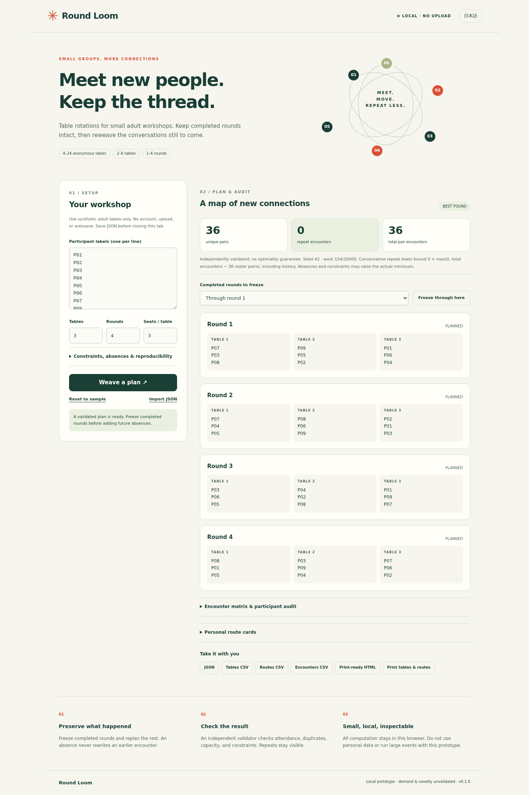
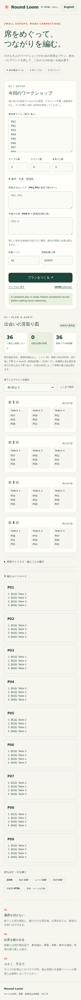

# Round Loom

Local, auditable table rotations for small adult workshops. 日本語 / English interface; a dependency-free Node CLI and solver; no accounts or runtime uploads.

**Prototype, not an event-management service.** Use synthetic adult labels only. Demand, commercial value, and novelty have not been validated. No license has been selected for this original project.

## Run locally

Node.js 22 or newer. Runtime and unit tests need no npm dependencies.

```sh
npm test
npm run build
npm run serve
# Open http://127.0.0.1:4173
```

The static files in `dist/` can be served by a standard HTTP server. ES modules and module workers require HTTP(S); opening `index.html` with `file://` is unsupported. The included server binds only to `127.0.0.1`. No deployment is performed by this repository.

### CLI

```sh
node src/cli.mjs solve fixtures/workshop.json /tmp/round-loom-new-output
node src/cli.mjs audit /tmp/round-loom-new-output/plan.json
```

The output directory must not exist. The command writes `plan.json`, `tables.csv`, `routes.csv`, `encounters.csv`, and a standalone `print.html`. Exit codes: 0 success, 2 input/output/usage error, 3 proven structural contradiction, 4 no valid full plan found within the work budget. Exit 4 does **not** mean impossible.

## What it does

- 4–24 roster labels, 2–6 nonempty tables, and 1–6 rounds
- Future-round table sizes differ by at most one, with a uniform per-table capacity
- Hard keep-apart pairs and absences beginning at a future round
- Freeze a completed prefix, retain exact table order and historical attendance, and replan the future
- Deterministic seeded, bounded search; best found, never a general optimality guarantee
- Independent hard-constraint validation and a recomputed encounter audit
- Formula-safe CSVs, planning JSON, printable table sheets and individual route cards
- Browser cancellation, safe re-import, input-change invalidation, and no automatic persistence

It does not promise everyone visits every physical table. Table numbers are locations, not a station-rotation constraint. It does not model hosts who remain seated, preferences, accessibility arrangements, durations, multiple rooms, participant identities, or simultaneous collaborators. Review all outputs before real-world use.

## 3-minute demo / 操作例

1. Click **プランをつくる / Weave a plan** to generate the nine-label example
2. Inspect unique pairs, repeats, table sheets, and the encounter matrix
3. Select **第2回まで / Through round 2** and **ここまで固定 / Freeze through here**
4. Open **条件・欠席・再現性 / Constraints, absences & reproducibility** and enter `P09:3` in absences
5. Rebuild. Rounds 1–2 retain their original historical data; P09 is absent from rounds 3–4
6. Download JSON before leaving the tab. Imports are validated, and imported audit metrics are discarded and recomputed

「確定済み」は改ざん防止や電子署名ではありません。将来の再計画が過去の記録を書き換えないという意味です。履歴固定を解除すれば、全ラウンドを再計画できます。履歴を保ったまま途中退席を扱う際は、名簿から削除せず「欠席」を追加してください。

## Search and audit semantics

An attempted table placement consumes one work unit. The default budget is 20,000 and the cap is 250,000. The budget excludes input validation, a separately bounded contradiction precheck, scoring, and output validation; it is not a wall-clock deadline. Search uses repeated randomized, constrained backtracking, with at most 3,000 placement attempts per round per construction. Completed plans are compared by total repeated pair encounters, then maximum pair frequency. Ties retain the earlier candidate. Search can stop when zero repeats are found; results still use the conservative label `best-found`.

Every unordered pair at a table contributes one encounter. A pair meeting three times contributes one unique pair and two repeat encounters. Per-person repeats count repeated meetings involving that person, so their sum is twice the global repeat count.

The displayed bound is `max(0, totalPairEncounters - n*(n-1)/2)`, where n is the fixed roster size, all frozen and future rounds are counted, and each unordered pair occurs at most once in one round. This pigeonhole bound is valid even with absences, but can be very loose. It does not account for disallowed pairs or prove optimality. The total number of encounters is determined by round attendance and balanced sizes. See [algorithm notes](docs/ALGORITHM.md).

## Input contract

See [schema and import rules](docs/SCHEMA.md). Labels are unique trimmed strings of 1–32 characters without control characters; they are anonymous identifiers, not names or personal information. A keep-apart UI line may be `P01,P02` or a JSON pair such as `["A,1","B"]`. The latter is needed when a label contains a comma. Absence lines use the last colon as a delimiter.

- New keep-apart, absence, and capacity rules apply only to future rounds
- Frozen rounds must be structurally valid and balanced, but are not retroactively checked against newly introduced keep-apart or capacity rules
- The roster retains historical participants; future absences do not delete them
- Imported JSON is capped at 256 KiB; invalid imports invalidate old exports
- All computed outputs are revalidated at export time

## Verification

```sh
npm run check
npm ci --ignore-scripts
npx playwright install --with-deps chromium
npm run serve
# In another terminal, with the server running:
npm run test:browser
npm run package
```

Verified at source commit [`c31ab9a`](https://github.com/Masanori-Spec/round-loom/commit/c31ab9a1c6b6cf3d0254b029364526ac9ced96f3): **30 tests passed in all four Node 22/24 × UTC/Asia/Tokyo CI jobs**, plus **13 browser scenarios passed with the Chromium sandbox enabled**. [View the successful CI run](https://github.com/Masanori-Spec/round-loom/actions/runs/37141006704). The browser report records no page errors or external requests.

The 30 tests include an independent exhaustive oracle over 1,088 small keep-apart graphs, 100 seeded larger cases, all 256 four-person absence-onset patterns, sparse-array regressions, and bounded regular-file CLI input. Desktop, 390 px mobile, and both A4 print pages were visually reviewed; no clipping was observed in those artifacts. See the [verification report](docs/VERIFICATION.md), [browser results](docs/evidence/browser-results.json), [artifact provenance](docs/evidence/provenance.json), and [print sample](docs/evidence/print.pdf).

The initial local browser attempt was blocked by this workspace's socket/ptrace restrictions before any scenario ran. It remains recorded separately in [local browser history](docs/LOCAL_BROWSER_HISTORY.md); the later sandboxed CI pass is separate evidence, not a reclassification of that blocked run.

Known cosmetic limitation: an already displayed status notice keeps its original language after switching Japanese/English, and table labels in personal routes remain English. The planning data and exports are unaffected. Real facilitator usability and demand remain untested.

CI uses `ubuntu-22.04` for sandboxed Chromium. That temporary runner baseline is scheduled to retire April 17, 2027; migrate and reverify before then. See [runner image policy](https://github.com/actions/runner-images#available-images).

## Screenshots from the verified CI run

Desktop sample: nine anonymous labels, four rounds, 36 unique pairs and zero repeat encounters for seed 42. This example does not imply every input admits a zero-repeat plan.



<details>
<summary>390 px mobile screenshot</summary>

The Japanese view retains the known English status and table-label text described above.



</details>

## Portfolio and product context

Existing products already solve group rotation and encounter repetition. Round Loom's proposed use case is the small, local, inspectable frozen-history workflow, not a claim that rotation planning is new. See [competitor evidence and evaluation plan](docs/PRODUCT.md).

Architecture: `src/schema.mjs` validates bounded input; `src/solver.mjs` searches; `src/validate.mjs` independently checks hard constraints and audits; `src/export.mjs` validates again and serializes; the UI runs search in `web/worker.mjs` so cancellation can terminate it. No third-party runtime code is shipped in the app. Playwright is a development-only browser-test dependency.
